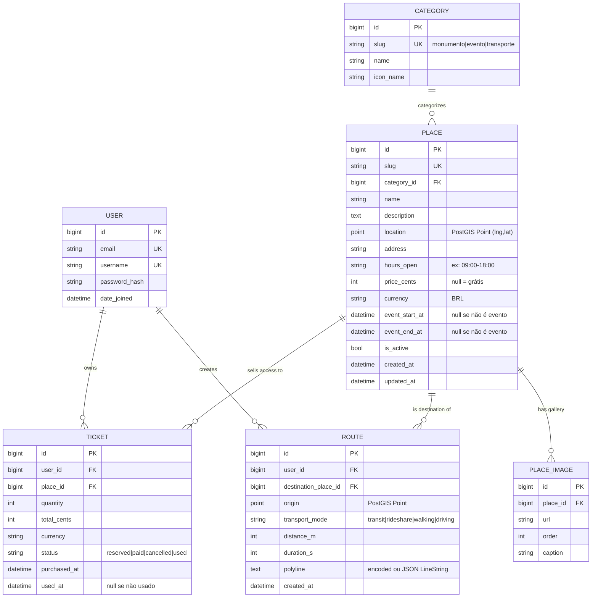
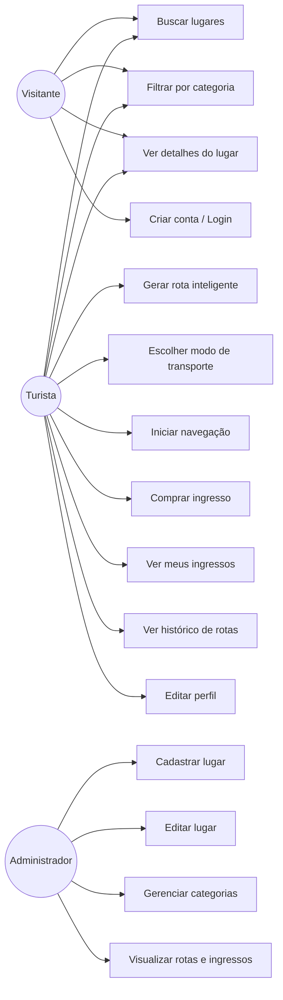
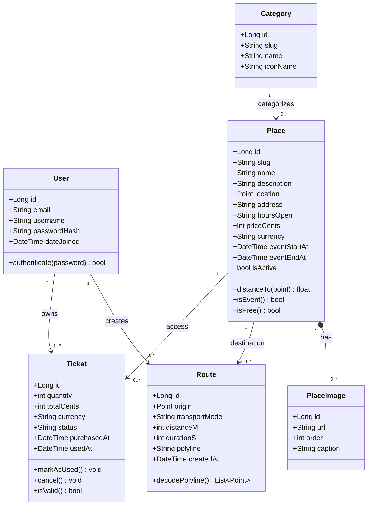
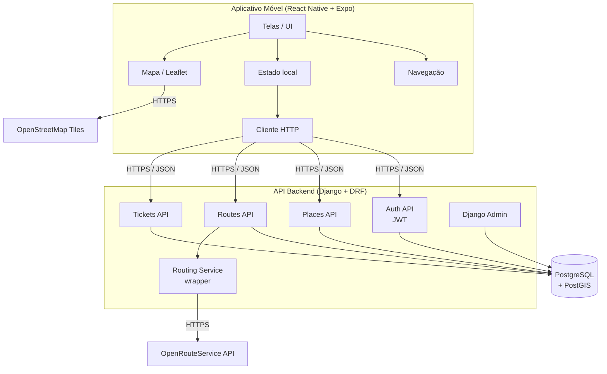
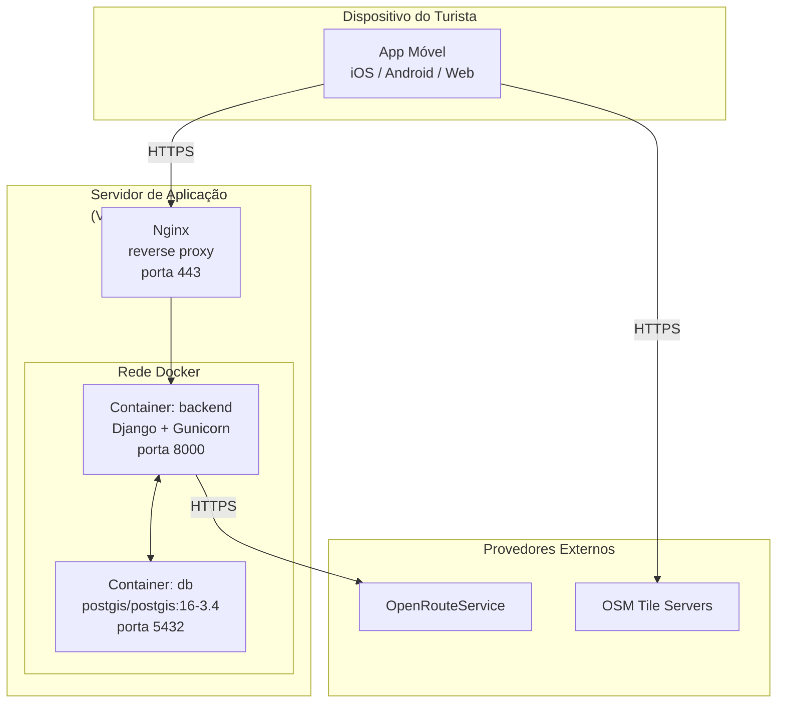
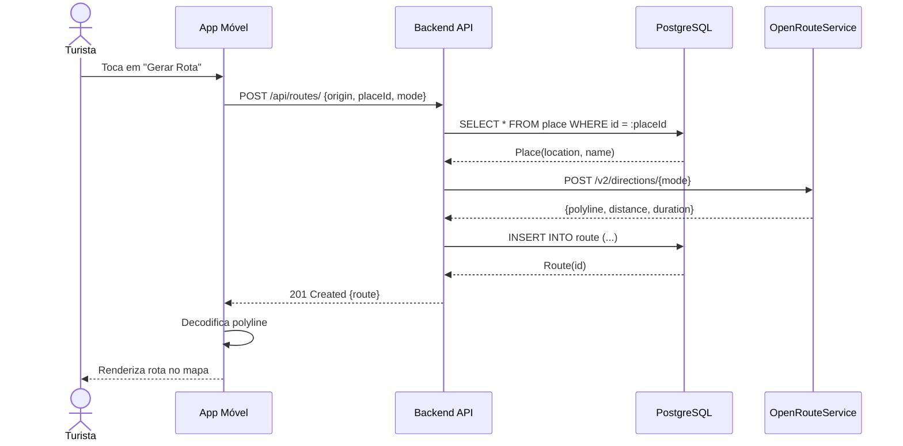
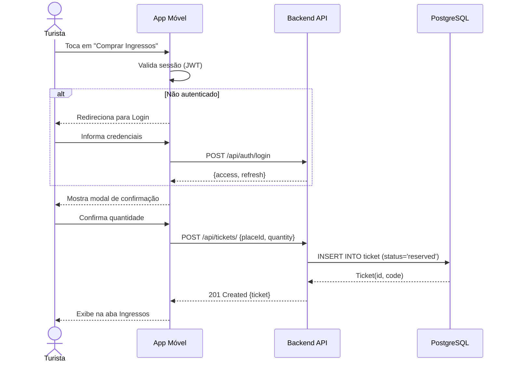
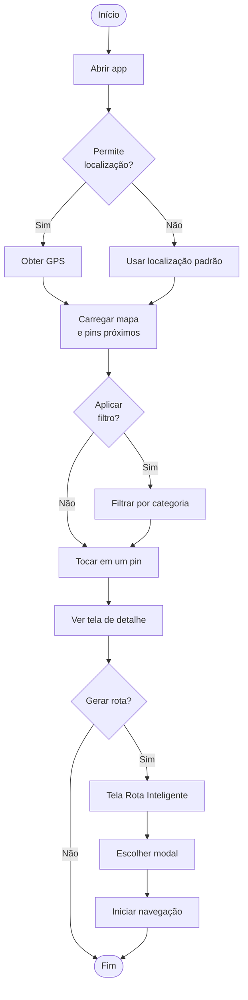
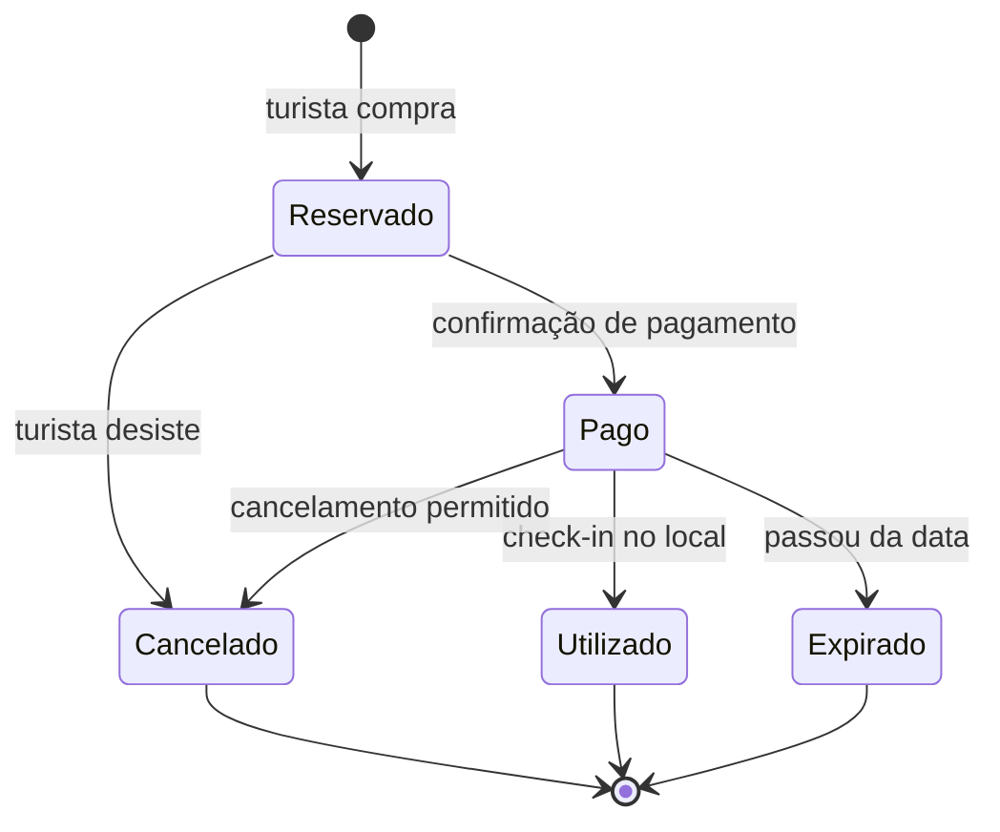

# Modelagem e Diagramas — Explora+

> Especificações de modelagem e diagramas UML do MVP. Base para a construção dos diagramas finais.

---

## Modelagem MVP (ER)

### Resumo das entidades

| Entidade | Por que existe no MVP |
|---|---|
| **User** (Django nativo) | autenticação, dono de rotas e ingressos |
| **Category** | popula os chips de filtro (Monumentos / Eventos / Transporte) |
| **Place** | unidade central do app. Contém localização PostGIS, conteúdo (PT), preço, e *opcionalmente* janela temporal pra eventos (`event_start_at` / `event_end_at` nullable — assim "evento" é só um Place com data) |
| **PlaceImage** | a tela Detalhe tem carousel de N imagens |
| **Route** | "Rota Inteligente" salva: origem, destino, modal, polyline, duração, distância |
| **Ticket** | aba Ingressos: histórico de compras com status |

### Decisões já tomadas (MVP)

- **Sem i18n**: tudo em PT, campo único `name`/`description` no Place
- **Evento ≠ tabela separada**: campos nullable no Place
- **Rota single-destination**: sem tabela `RouteWaypoint` — destino é um único `Place`
- **Sem Favorite, sem UserProfile**: cortados do MVP
- **Sem PlaceTranslation**: cortado junto com i18n
- **Polyline na Route**: campo `text` (encoded polyline) — mais barato de armazenar e o frontend decoda

---

## Diagramas UML

### Casos de Uso

### Classes

### Componentes

### Implantação

### Sequência — Gerar Rota

### Sequência — Compra de Ingresso

### Atividade — Explorar e Gerar Rota

### Estados — Ciclo do Ticket

