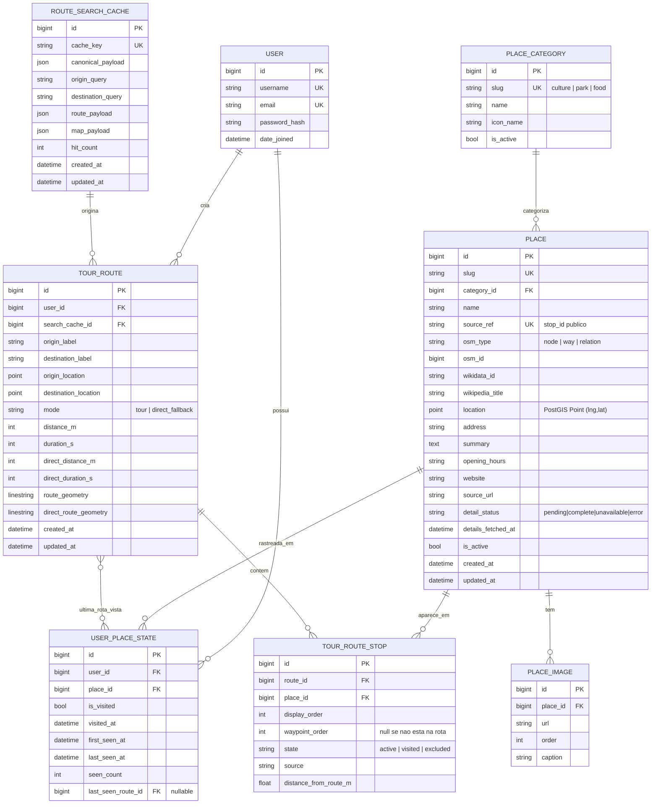
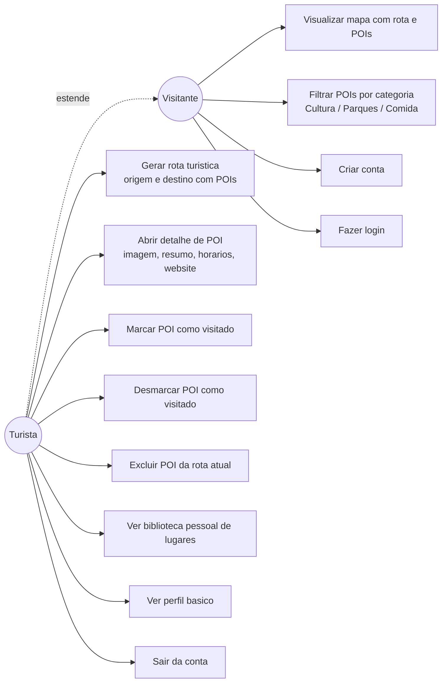
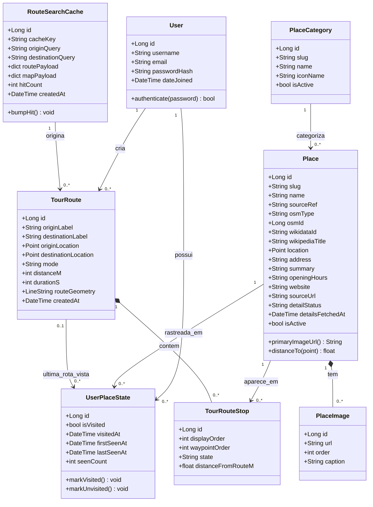
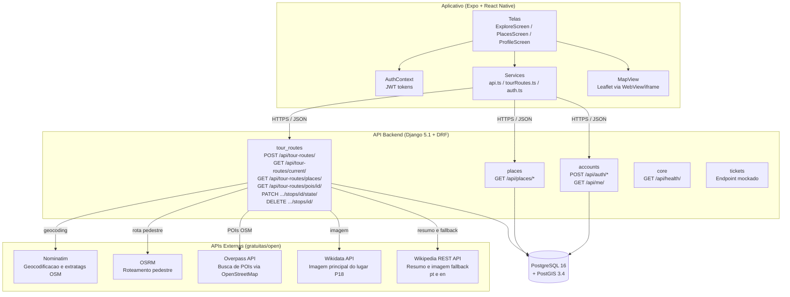
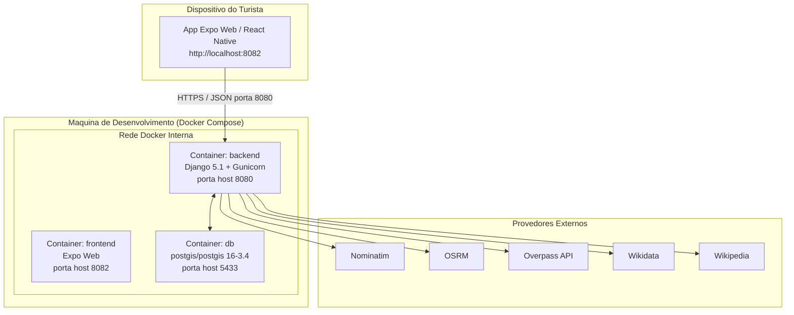
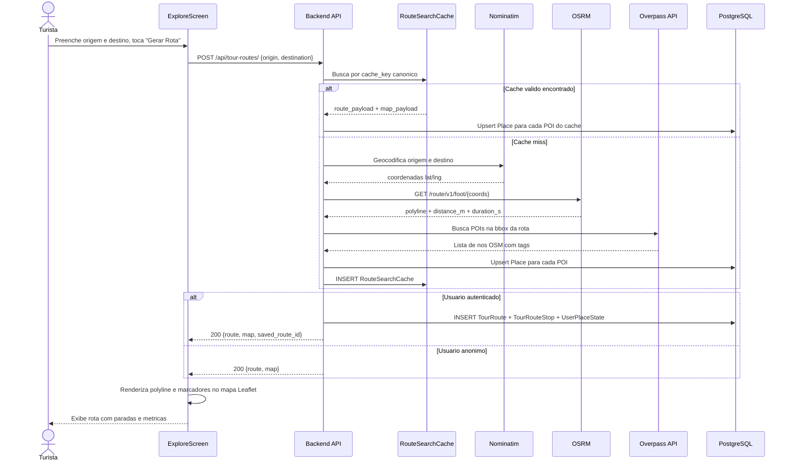
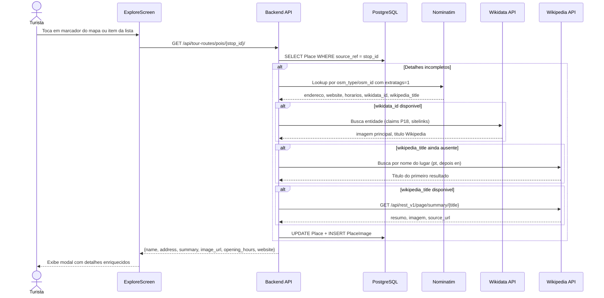
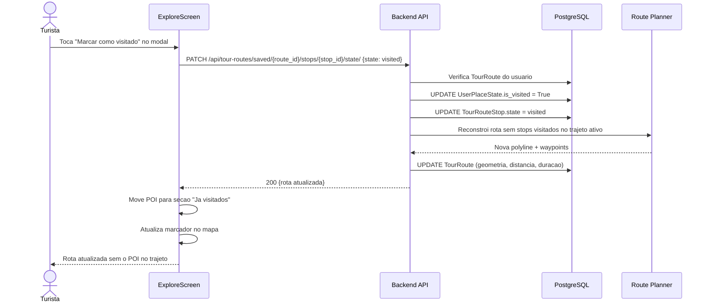
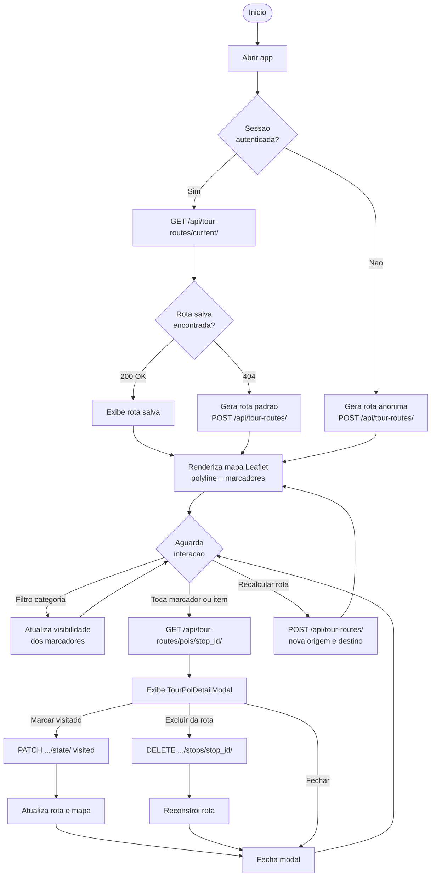
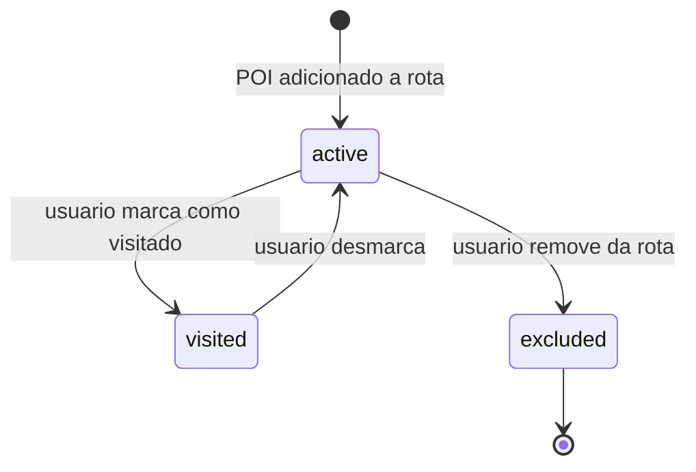

# Modelagem e Diagramas — Explora+

> Especificacoes de modelagem e diagramas UML do MVP entregue.
> Fontes Mermaid em `diagramas/mermaid/`. Projeto Modelio em `diagramas/explora_mais-diagramas-uml/`.

---

## Diagrama ER

### Resumo das entidades

| Entidade | Papel |
|---|---|
| **User** (Django nativo) | autenticacao JWT; dono de rotas e estados de lugares |
| **PlaceCategory** | taxonomia de POIs: `culture`, `park`, `food` |
| **Place** | fonte unica de verdade de um ponto de interesse; campo PostGIS `location`; enriquecido progressivamente via APIs externas |
| **PlaceImage** | galeria de imagens de um lugar (URL, order) |
| **UserPlaceState** | estado global usuario x lugar: visitado, datas, contagem, ultima rota |
| **RouteSearchCache** | cache de rota calculada por chave canonica (origem + destino); evita recalculo desnecessario via Nominatim/OSRM/Overpass |
| **TourRoute** | snapshot relacional da rota personalizada do usuario; geometria LineString PostGIS |
| **TourRouteStop** | cada POI na rota do usuario com estado `active / visited / excluded` |

### Decisoes de modelagem

- **`source_ref`**: identificador publico do POI (ex: ID OSM). E o `stop_id` no contrato HTTP.
- **`detail_status`**: controla o ciclo de enriquecimento. `pending` -> busca ao abrir; `complete` -> tem dados; `unavailable` -> APIs nao retornaram nada; `error` -> falha de rede.
- **Sem tabela de Ticket**: tickets existem como endpoint mockado sem fluxo de compra real no MVP.
- **Sem modal de transporte**: so caminhada suportada. OSRM opera em modo `foot`.
- **Sem Administrador no app**: lugares populados via `seed_demo` e descoberta automatica pelo Overpass.

---

## Casos de Uso

> Turista **estende** Visitante: herda UC1-UC4 e adiciona acoes que exigem autenticacao.

---

## Diagrama de Classes

---

## Diagrama de Componentes

---

## Diagrama de Implantacao

---

## Sequencia — Gerar Rota Turistica

---

## Sequencia — Enriquecimento de Detalhe de POI

---

## Sequencia — Marcar como Visitado

---

## Diagrama de Atividade — Explorar e Gerar Rota

---

## Estados — Stop na Rota

